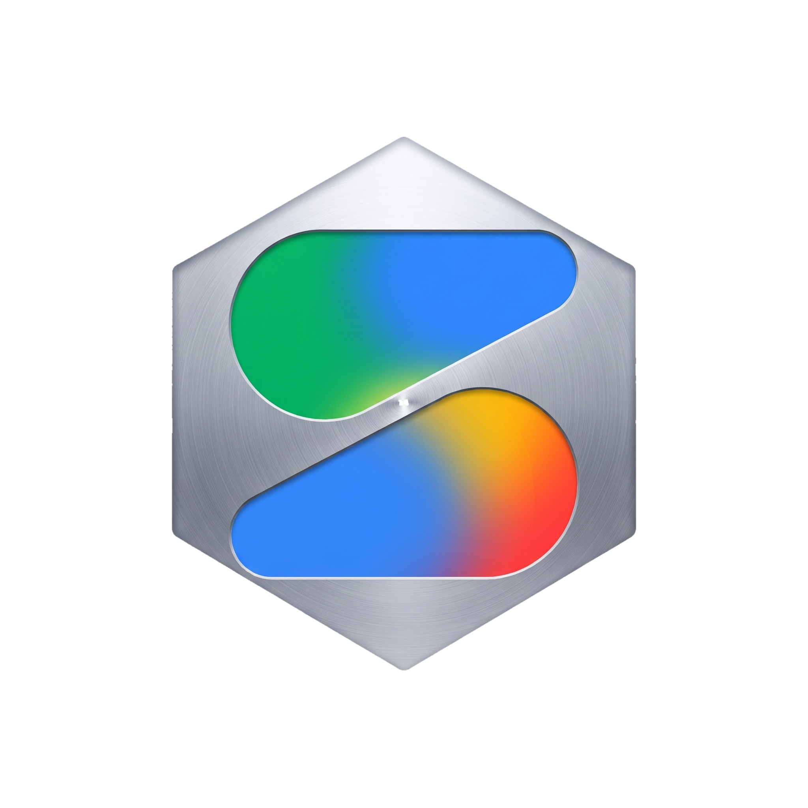

<p align="center">
  
</p>

<h1 align="center">GAS MCP</h1>

<p align="center">
  A Model Context Protocol (MCP) server for <strong>Google AI Studio</strong> (Gemini API),<br>
  with a built-in Ink terminal UI for API key, model, and token-usage management.
</p>

---

GAS MCP exposes every model in the Google AI Studio catalog to any MCP-compatible client through three tools: `chat_completion`, `list_models`, and `get_model_capabilities`. It accepts OpenAI-style messages and function schemas and translates them to Gemini's native format, supports multimodal (vision) input, and logs token usage locally. The bundled TUI lets you manage multiple API key profiles, switch the default model, and review usage — changes take effect on the running server instantly, no restart needed.

> **Windows only.** Setup, launcher, and shortcut scripts (`setup.bat`, `run.bat`, `make_shortcut.vbs`) are Windows-specific.

## Installation

**Prerequisite:** Python 3.10+ on PATH.

### Option A — let a code agent install it

Paste this into any code agent (Claude Code, Cursor, Windsurf, ...) and it will download and install everything for you:

```text
Clone https://github.com/liewcc/GAS_MCP to a local folder of my choice,
then run setup.bat inside it and confirm it finishes without errors.
It needs Python 3.10+; everything else (venv, portable Node.js, TUI deps)
is handled by the script.
```

### Option B — manual

Clone the repo and run:

```bat
setup.bat
```

The script is fully automated:

1. Creates a default `config.json` if missing
2. Verifies Python 3.10+
3. Creates `.venv` and installs server dependencies (`mcp`, `httpx`, `python-dotenv`)
4. Downloads portable Node.js v20 into `.node_venv` (no system-wide Node install)
5. Installs TUI dependencies (`ink`, `react`, `esbuild`)
6. Creates a desktop shortcut

## Connecting to an MCP client

The easiest way: paste this into any code agent (Claude Code, Cursor, Windsurf, ...):

```text
Help me install the MCP server at D:\path\to\GAS_MCP into my MCP client config.
The command is .venv\Scripts\python.exe server.py run from that directory,
transport is stdio, and the server name is "gas".
```

Or add it manually, e.g. for Claude Desktop / Claude Code:

```json
{
  "mcpServers": {
    "gas": {
      "command": "D:\\path\\to\\GAS_MCP\\.venv\\Scripts\\python.exe",
      "args": ["D:\\path\\to\\GAS_MCP\\server.py"]
    }
  }
}
```

## API key

Get a free API key at [Google AI Studio](https://aistudio.google.com/). Then either:

- Add it as a profile in the TUI's **API KEY** tab (recommended — supports multiple profiles and instant switching), or
- Set `GAS_API_KEY` in a `.env` file next to `server.py` (fallback when no profile is active)

One key works for every model in the catalog.

## TUI

```bat
run.bat
```

(or use the desktop shortcut — a second launch is refused while a TUI window is already open)

| Tab | What it does |
|-----|--------------|
| **API KEY** | Create / edit / delete / switch API key profiles (keys shown masked) |
| **MODELS** | Browse the live model catalog and pick the `default_model` |
| **USAGE** | Token usage per MCP call, newest first, auto-refreshing while open |
| **EXIT** | Quit (with confirmation) |
| **AI STUDIO** | Opens aistudio.google.com in the browser |
| **REPO** | Opens this repository in the browser |

**Keys:** `←`/`→` switch tabs · `Enter`/`↓` enter a tab · `↑`/`↓` move within lists · `→` jump to the right panel · `Tab`/`Esc` go back · `Ctrl+C` quit.

## MCP tools

### `chat_completion`

Generate a completion with any chat model in the catalog.

| Arg | Default | Notes |
|-----|---------|-------|
| `messages` | required | OpenAI-style `{role, content}`; `system` becomes Gemini `systemInstruction` |
| `model` | TUI's `default_model` | Falls back to `gemini-2.5-flash` if unset |
| `temperature` | `0.7` | |
| `max_tokens` | `8192` | |
| `top_p` | `1.0` | |
| `seed` | none | For deterministic output |
| `tools` | none | OpenAI-style function schemas, translated to Gemini `functionDeclarations` |

If the model requests a function call, the raw candidate `content` JSON (with `functionCall` parts) is returned instead of plain text, so the caller can execute the tool and continue.

**Vision input** — pass Gemini-style content parts instead of a string:

```json
{
  "messages": [
    {
      "role": "user",
      "content": [
        {"text": "What is in this image?"},
        {"inline_data": {"mime_type": "image/png", "data": "<base64>"}}
      ]
    }
  ]
}
```

### `list_models`

Returns the sorted list of model ids available to the active API key (live query to `/v1beta/models`).

### `get_model_capabilities`

Returns `{type, vision, tools, context, notes}` for a model id. Call it before `chat_completion` to check whether a model supports vision or tool calling — models of type `embed`, `image`, `video`, or `other` are rejected for chat.

## Architecture notes

- **Instant hot-swap** — the server re-reads `config.json` on every call, so switching the active API key profile or default model in the TUI takes effect immediately on the running server.
- **Token tracking** — Gemini's `usageMetadata` (prompt / candidates / thoughts / cached / total tokens) is appended to `usage_log.jsonl` after each call, trimmed to the last 500 entries. Logging is best-effort behind a thread lock and never breaks a completion.
- **Capability inference** — models not listed in `model_capabilities.json` are classified by naming heuristics (`embed`, `imagen`, `veo`, `aqa`, `gemini`), so unknown models still get sensible vision/tools flags instead of malformed-payload errors.
